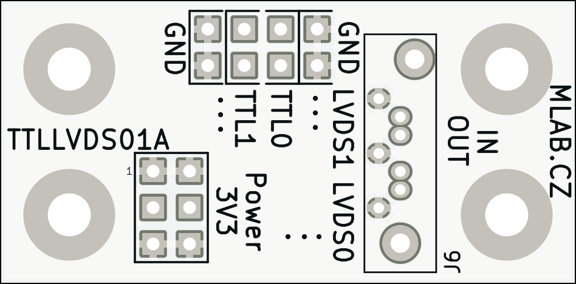

<!--- PrjInfo ---> <!--- Please remove this line after manually editing --->
<!--- 00a56be08b96043df9e37d6aff7b6990 --->
<!--- Created:2019-02-18 14:57:49.031132: ---> 
<!--- Author:: ---> 
<!--- AuthorEmail:: ---> 
<!--- Tags:: ---> 
<!--- Ust:: ---> 
<!--- Label --->
<!--- ELabel ---> 
<!--- Name:TTLLVDS01A: --->
# TTLLVDS01A
<!--- LongName --->
## TTL to LVDS converter and vice versa
<!--- ELongName ---> 

<!--- Lead --->
TTLLVDS is TTL to LVDS and LVDS to TTL converter. Module can be used to connect a simple TTL signal to LVDS input. By changing the components, it can acts as LVDS to TTL convertor. To covert differencial LVDS signal to TTL output. Each module converts two signals. 
<!--- ELead ---> 

 

<!--- Description --->
The TTL signal is connected using a simple header. Differential LVDS signal is connected trought SATA connector and cable. Each sata connector contains two pairs of LVDS signals. 
<!--- EDescription --->
<!--- Content --->
<!--- EContent --->
